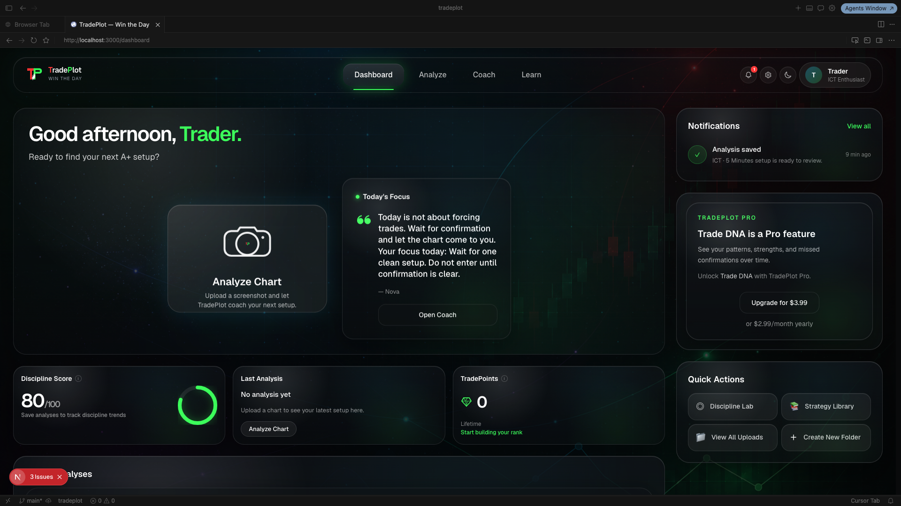
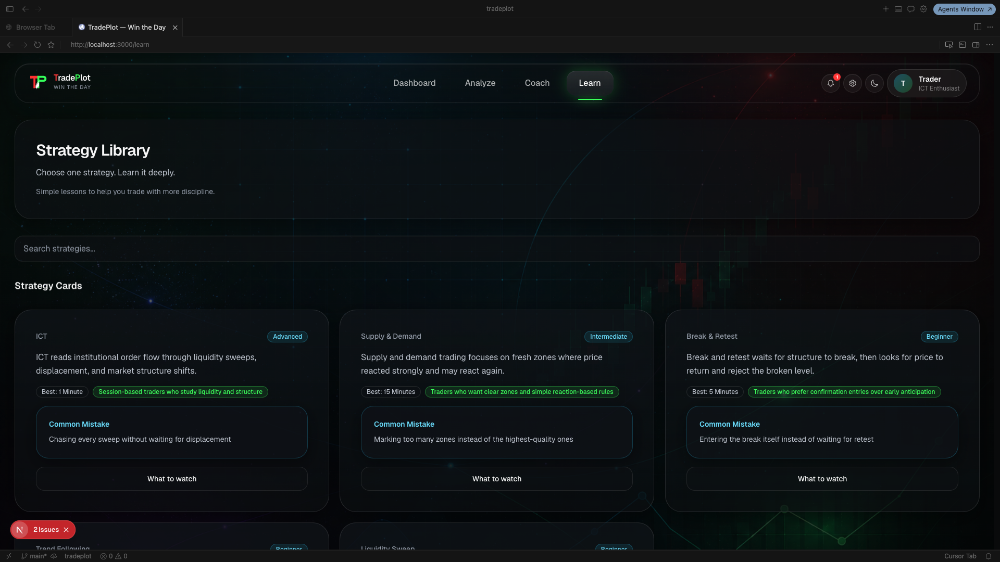

  

# TradePlot

### AI-Powered Trading Intelligence

Analyze. Learn. Execute.

TradePlot is an AI trading platform that helps traders improve discipline, understand market structure, and make higher-quality trading decisions through AI coaching, visual chart analysis, and personalized performance tracking.

**Built with Next.js • TypeScript • Supabase • Stripe • OpenAI**

---

# Overview

TradePlot combines chart analysis, execution coaching, psychology tracking, and structured learning into a single platform.

Instead of giving buy or sell signals, TradePlot teaches traders **how to think**.

---

# Features

### 📊 AI Chart Analysis

- Screenshot upload
- AI chart interpretation
- Context-aware coaching
- Multi-timeframe analysis
- Strategy-specific breakdowns

---

### 🧠 AI Coach

- Personalized AI mentor
- Custom coach personality
- Daily execution coaching
- Emotional check-ins
- Discipline tracking

---

### 📚 Strategy Library

- ICT
- Supply & Demand
- Break & Retest
- Liquidity Sweeps
- Order Blocks
- Market Structure
- Psychology

---

### 📈 Performance Tracking

- Trade journal
- Win rate tracking
- Discipline Score
- Trade DNA
- Emotional trends
- AI reflections

---

# Tech Stack

| Frontend | Backend | AI | Infrastructure |
|----------|----------|----|----------------|
| Next.js | Supabase | OpenAI | Vercel |
| TypeScript | PostgreSQL | Vision Models | GitHub |
| Tailwind CSS | Auth | AI Coaching | Stripe |

---

# Application Preview

## Landing Page

---

## Dashboard

---

## Analyze Chart

---

## Complete Analysis

---

## Detailed Breakdown

---

## AI Coach

---

## Coach Personalization

---

## Strategy Library

---

# Current Modules

- Landing Page
- Authentication
- Dashboard
- Analyze
- AI Coach
- Learn
- Strategy Library
- Upload Manager
- Performance Tracking
- Discipline Engine
- Trade DNA
- Stripe Billing

---

# Future Roadmap

- AI Voice Coach
- Mobile Apps
- Replay Mode
- Strategy Marketplace
- Community Challenges
- Broker Integrations
- Live Chart Analysis
- Portfolio Tracking
- AI Trade Review
- Journal Intelligence

---

# Disclaimer

TradePlot is an educational platform.

It does **not** provide financial advice, investment recommendations, or guaranteed trading results.

Users remain responsible for all trading decisions.

---

### Built by Tyler Sheffield

**Trade smarter. Build discipline. Win the day.**

